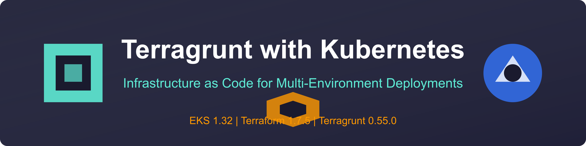
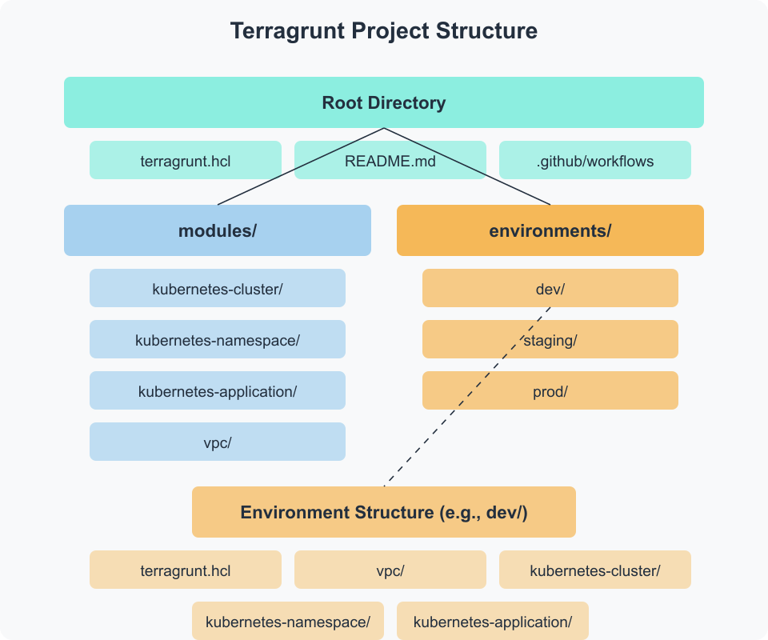
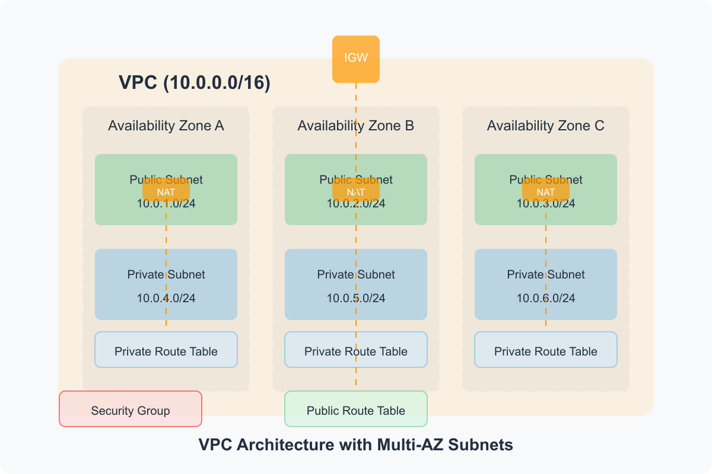
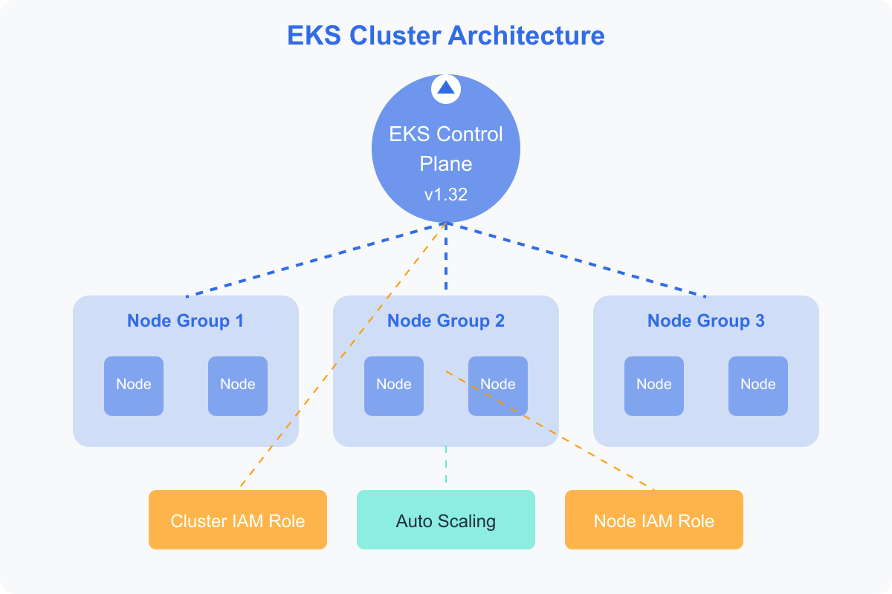
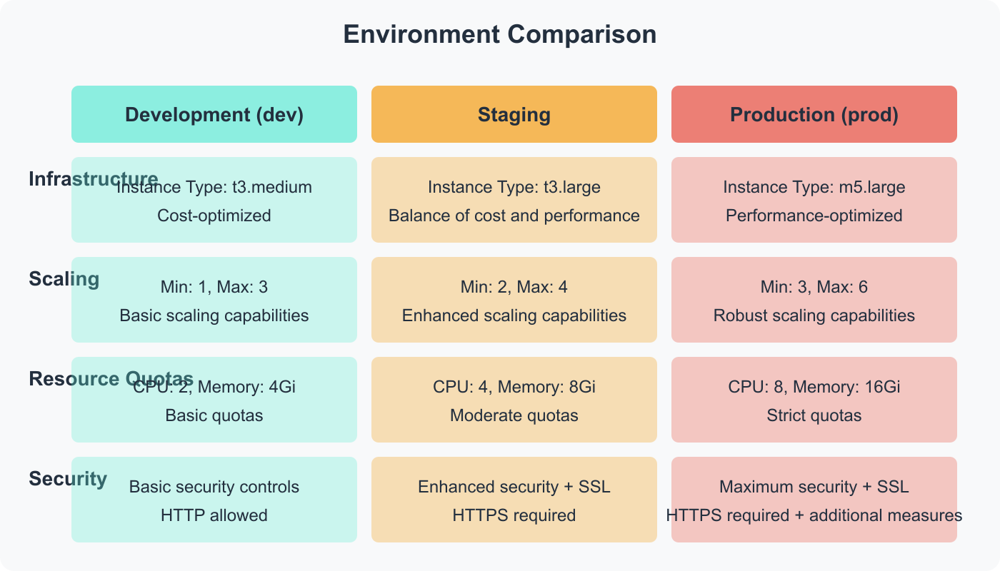
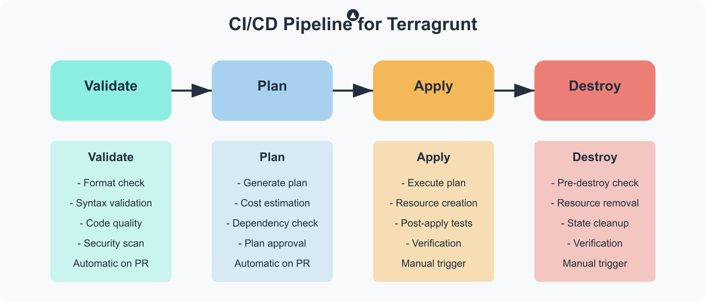

# Terragrunt with EKS Infrastructure Automation

<div align="center">
  
  <p><em>Enterprise-grade Infrastructure as Code for Kubernetes on AWS with Automated Deployment</em></p>
</div>

## 📋 Overview

This production-ready infrastructure project uses **Terragrunt** to manage multiple environments (dev, staging, prod) for **Kubernetes** deployments on **AWS EKS**. Built with a focus on automation, maintainability, and security, it provides a complete solution for deploying and managing containerized applications at scale.

### Key Features

- ✅ **Multi-environment Infrastructure**: Isolated dev, staging, and production environments
- ✅ **Latest Technology Stack**: EKS 1.32, Terraform 1.7.5, Terragrunt 0.55.0
- ✅ **Complete Automation**: CI/CD pipelines for infrastructure and application deployment
- ✅ **DRY Infrastructure Code**: Reusable modules with inheritance patterns
- ✅ **Security-First Design**: Network isolation, least privilege IAM, and encryption
- ✅ **Cost Optimization**: Environment-specific resource allocation

<div align="center">
  
</div>

## 🏗️ Architecture

The infrastructure follows AWS best practices and is built with a multi-tier architecture:

### Network Layer
- **VPC Architecture**: Isolated network with CIDR block allocation for each environment
- **Multi-AZ Design**: Resources distributed across 3 availability zones for high availability
- **Public & Private Subnets**: Public subnets for load balancers, private subnets for EKS nodes
- **NAT Gateways**: Redundant NAT gateways for secure outbound internet access
- **Transit Gateway**: For connecting multiple VPCs in larger deployments
- **Network ACLs & Security Groups**: Defense-in-depth security approach

### Kubernetes Layer
- **EKS Control Plane**: Managed by AWS with version 1.32 and automatic updates
- **Managed Node Groups**: Auto-scaling worker nodes with spot instance support
- **Fargate Profiles**: For serverless workloads with specific requirements
- **IRSA (IAM Roles for Service Accounts)**: Fine-grained IAM permissions for pods
- **Cluster Autoscaler**: Automatic scaling based on workload demands
- **Kubernetes Add-ons**: AWS Load Balancer Controller, ExternalDNS, Cluster Autoscaler

### Application Layer
- **Namespaces**: Logical isolation with resource quotas and network policies
- **Deployments**: Rolling updates with health checks and auto-scaling
- **Services & Ingress**: External and internal traffic management
- **ConfigMaps & Secrets**: Secure configuration management
- **Persistent Volumes**: EBS and EFS storage integration

### Environment-Specific Configurations

| Environment | Instance Types | Node Count | Autoscaling | Resource Quotas | Security Features |
|-------------|---------------|------------|-------------|-----------------|-------------------|
| Dev         | t3.medium + Spot | 2-4 | 1-6 nodes | Basic limits | Standard encryption |
| Staging     | t3.large | 2-5 | 2-8 nodes | Moderate limits | Enhanced security + SSL |
| Production  | m5.large/m5.xlarge | 3-6 | 3-12 nodes | Strict limits | Maximum security + SSL + WAF |

## 📂 Project Structure

```
.
├── docs/                        # Documentation and images
│   └── images/                  # Architecture diagrams and screenshots
├── .github/
│   └── workflows/
│       └── terragrunt.yml       # CI/CD pipeline configuration
├── environments/                # Environment-specific configurations
│   ├── dev/                     # Development environment
│   │   ├── kubernetes-application/
│   │   ├── kubernetes-cluster/
│   │   ├── kubernetes-namespace/
│   │   ├── terragrunt.hcl       # Dev environment configuration
│   │   └── vpc/
│   ├── staging/                 # Staging environment
│   │   ├── kubernetes-application/
│   │   ├── kubernetes-cluster/
│   │   ├── kubernetes-namespace/
│   │   ├── terragrunt.hcl       # Staging environment configuration
│   │   └── vpc/
│   └── prod/                    # Production environment
│       ├── kubernetes-application/
│       ├── kubernetes-cluster/
│       ├── kubernetes-namespace/
│       ├── terragrunt.hcl       # Prod environment configuration
│       └── vpc/
├── modules/                     # Reusable Terraform modules
│   ├── kubernetes-application/  # Module for deploying applications to Kubernetes
│   ├── kubernetes-cluster/      # Module for creating a Kubernetes cluster
│   ├── kubernetes-namespace/    # Module for creating Kubernetes namespaces
│   └── vpc/                     # Module for creating a VPC
├── README.md                    # Project documentation
└── terragrunt.hcl               # Root Terragrunt configuration
```

<div align="center">
  
</div>

## 🚀 Getting Started

### Prerequisites

- [Terraform](https://www.terraform.io/downloads.html) (v1.7.0 or later)
- [Terragrunt](https://terragrunt.gruntwork.io/docs/getting-started/install/) (v0.55.0 or later)
- [AWS CLI](https://aws.amazon.com/cli/) configured with appropriate credentials
- [kubectl](https://kubernetes.io/docs/tasks/tools/install-kubectl/) for interacting with Kubernetes clusters

### Installation

1. Clone this repository:

```bash
git clone https://github.com/santoshbaruah/terragrunt-EKS-infrastructure.git
cd terragrunt-EKS-infrastructure
```

2. Configure AWS credentials:

```bash
aws configure
```

3. Initialize and apply the infrastructure for a specific environment:

```bash
cd environments/dev
terragrunt run-all init
terragrunt run-all plan
terragrunt run-all apply
```

4. Configure kubectl to interact with your new cluster:

```bash
aws eks update-kubeconfig --name eks-dev --region us-west-2
kubectl get nodes
```

### Destroying Infrastructure

To tear down the infrastructure when no longer needed:

```bash
cd environments/dev
terragrunt run-all destroy
```

## 🧩 Modules

### VPC Module

Creates a complete networking stack with:
- VPC with CIDR block
- Public and private subnets across multiple AZs
- Internet Gateway and NAT Gateways
- Route tables and security groups
- Proper tagging for Kubernetes integration

<div align="center">
  
</div>

### Kubernetes Cluster Module

Creates an EKS cluster with:
- EKS control plane running Kubernetes 1.32
- Managed node groups with auto-scaling
- IAM roles and policies for proper operation
- Cluster logging and monitoring
- Security group configurations

<div align="center">
  
</div>

### Kubernetes Namespace Module

Creates isolated Kubernetes namespaces with:
- Resource quotas to limit resource consumption
- Network policies for traffic control
- Labels and annotations for organization
- Service account configurations

### Kubernetes Application Module

Deploys applications to Kubernetes with:
- Deployments with replica sets
- Services for internal communication
- Ingress resources for external access
- Resource limits and requests
- Health checks and probes
- Environment-specific configurations

## 🌐 Environments

### Development (dev)

The development environment is designed for rapid iteration and testing:

- **Infrastructure**: Lightweight and cost-effective
- **Scaling**: Minimal resources with fast scaling
- **Security**: Basic security controls
- **Monitoring**: Standard logging

### Staging

The staging environment mirrors production for pre-release testing:

- **Infrastructure**: Medium-sized resources
- **Scaling**: Moderate auto-scaling capabilities
- **Security**: Enhanced security controls with SSL
- **Monitoring**: Advanced logging and basic alerting

### Production (prod)

The production environment is optimized for reliability, performance, and security:

- **Infrastructure**: Production-grade resources
- **Scaling**: Robust auto-scaling with higher limits
- **Security**: Maximum security controls with SSL and additional measures
- **Monitoring**: Comprehensive logging, monitoring, and alerting

<div align="center">
  
</div>

## 🔄 CI/CD Pipeline

This project implements a GitOps approach with a comprehensive GitHub Actions workflow for infrastructure automation:

<div align="center">
  
</div>

### Automated Workflow

The CI/CD pipeline follows a structured approach to infrastructure deployment:

1. **Code Quality & Security** (Automated):
   - Terragrunt HCL formatting validation
   - Terraform configuration validation
   - Static code analysis with tflint
   - Security scanning with tfsec and checkov
   - Policy compliance with OPA/Conftest
   - Infrastructure cost estimation

2. **Plan Generation** (Automated):
   - Parallel plan generation for all environments
   - Plan visualization and approval workflow
   - Cost difference analysis
   - Drift detection from previous state
   - Dependency graph visualization

3. **Infrastructure Deployment** (Approval Required):
   - Environment-specific deployment workflows
   - Progressive deployment (dev → staging → prod)
   - Canary deployments for critical components
   - Automatic rollback on failure
   - Post-deployment validation tests
   - Infrastructure health checks

4. **Monitoring & Verification** (Automated):
   - Continuous infrastructure monitoring
   - Compliance verification
   - Performance benchmarking
   - Cost optimization recommendations
   - Security posture assessment

### Setting Up the Pipeline

1. **Configure GitHub Repository**:
   - Enable GitHub Actions
   - Set branch protection rules
   - Configure required reviewers for PRs

2. **Set Required Secrets**:
   ```
   AWS_ACCESS_KEY_ID          # AWS access key with limited permissions
   AWS_SECRET_ACCESS_KEY      # AWS secret access key
   AWS_REGION                 # Default AWS region (e.g., us-west-2)
   TERRAFORM_STATE_BUCKET     # S3 bucket for Terraform state
   TERRAFORM_LOCK_TABLE       # DynamoDB table for state locking
   SLACK_WEBHOOK_URL          # For notifications (optional)
   ```

3. **Configure Workflow Triggers**:
   - Automatic on pull requests to main branch
   - Manual triggers for specific environments
   - Scheduled runs for drift detection

For detailed instructions on setting up GitHub Actions and configuring the required secrets, see our [GitHub Actions Setup Guide](docs/github-actions-setup.md).

## 📊 Observability Stack

The infrastructure includes a comprehensive observability stack for monitoring, logging, and alerting:

### Monitoring

- **AWS CloudWatch**: Core monitoring for AWS resources with custom dashboards
- **Prometheus**: Kubernetes-native monitoring with service discovery
- **Grafana**: Advanced visualization and dashboards
- **Kubernetes Metrics Server**: Resource utilization tracking
- **Custom Metrics API**: Application-specific metrics collection

### Logging

- **EKS Control Plane Logging**: All control plane components logged to CloudWatch
- **Container Logging**: Fluent Bit for container log collection
- **Application Logging**: Structured logging with correlation IDs
- **Audit Logging**: Comprehensive audit trail for security events
- **Log Aggregation**: Centralized logging with Elasticsearch

### Alerting

- **CloudWatch Alarms**: Threshold-based alerting for AWS resources
- **Prometheus Alertmanager**: Advanced alerting with grouping and routing
- **PagerDuty Integration**: On-call notification system
- **Slack Notifications**: Real-time alerts in team channels
- **Automated Remediation**: Self-healing for common issues

### Dashboards

- **Infrastructure Overview**: High-level health and performance
- **Cluster Insights**: Detailed Kubernetes cluster metrics
- **Cost Optimization**: Resource utilization and cost tracking
- **Security Posture**: Compliance and vulnerability monitoring
- **Application Performance**: End-to-end request tracing

## 🔒 Security Architecture

This infrastructure implements a defense-in-depth security approach with multiple layers of protection:

### Network Security

- **VPC Isolation**: Separate VPC for each environment with no direct connectivity
- **Private Subnets**: All EKS nodes and databases run in private subnets
- **Security Groups**: Granular inbound/outbound rules with least privilege
- **Network ACLs**: Additional subnet-level traffic filtering
- **AWS PrivateLink**: Private connectivity to AWS services
- **VPC Flow Logs**: Network traffic logging and analysis

### Access Control

- **IAM Roles**: Fine-grained permissions with least privilege principle
- **IRSA (IAM Roles for Service Accounts)**: Pod-level IAM permissions
- **Kubernetes RBAC**: Role-based access control for all Kubernetes resources
- **AWS STS**: Temporary credentials with short lifetimes
- **MFA**: Multi-factor authentication for all human access
- **SSO Integration**: Centralized identity management

### Data Protection

- **Encryption at Rest**: All EBS volumes, S3 buckets, and databases
- **Encryption in Transit**: TLS for all API communications
- **KMS Integration**: Customer-managed keys for sensitive data
- **Secrets Management**: AWS Secrets Manager for credentials
- **Pod Security Policies**: Prevent privileged containers
- **EKS Security Groups for Pods**: Network isolation at pod level

### Compliance & Governance

- **Automated Compliance Checks**: Regular scanning against CIS benchmarks
- **Security Posture Monitoring**: Continuous assessment with AWS Security Hub
- **Audit Logging**: Comprehensive audit trails for all actions
- **GitOps Workflow**: All changes through version-controlled pull requests
- **Immutable Infrastructure**: Prevent runtime modifications
- **Regular Security Assessments**: Scheduled penetration testing

## 🛠️ Advanced Usage

### Adding a New Module

To create a new reusable module:

1. Create a directory in the `modules` folder
2. Define the module's resources, variables, and outputs
3. Reference it from environment-specific configurations

### Adding a New Environment

To add a new environment (e.g., "qa"):

1. Create a new directory under `environments`
2. Copy and modify the configuration from an existing environment
3. Update environment-specific variables

### Customizing Resource Allocations

To adjust resource allocations for an environment:

1. Modify the environment's `terragrunt.hcl` file
2. Update instance types, counts, and other parameters
3. Apply the changes with `terragrunt run-all apply`

## 🧪 Development and Testing

This infrastructure is designed for continuous development and testing with built-in validation at every step.

### Local Development Workflow

1. **Setup Local Environment**:
   ```bash
   # Install required tools
   brew install terraform terragrunt kubectl aws-cli

   # Clone repository
   git clone https://github.com/santoshbaruah/terragrunt-EKS-infrastructure.git
   cd terragrunt-EKS-infrastructure
   ```

2. **Infrastructure Development**:
   ```bash
   # Make changes to modules or environments
   cd modules/kubernetes-cluster

   # Validate changes
   terraform validate
   terraform fmt

   # Test changes in dev environment
   cd ../../environments/dev/kubernetes-cluster
   terragrunt validate
   terragrunt plan
   ```

3. **Testing Infrastructure Changes**:
   ```bash
   # Run automated tests
   cd tests
   ./run_integration_tests.sh dev

   # Validate infrastructure with policy checks
   terragrunt run-all hclfmt
   terragrunt run-all validate

   # Run security scanning
   tfsec .
   checkov -d .
   ```

### Automated Testing Pipeline

The CI/CD pipeline includes comprehensive testing:

1. **Static Analysis**:
   - HCL format validation
   - Terraform validation
   - Security scanning with tfsec and checkov
   - Policy compliance with OPA/Conftest

2. **Integration Testing**:
   - Automated deployment to test environment
   - Infrastructure validation tests
   - Network connectivity tests
   - IAM permission tests
   - Kubernetes functionality tests

3. **Load Testing**:
   - Cluster scalability tests
   - Resource allocation tests
   - Performance benchmarking

4. **Cleanup**:
   - Automatic resource teardown
   - State verification

### Testing Best Practices

- **Test in Isolation**: Each module has its own test suite
- **Infrastructure as Code Testing**: Use Terratest for infrastructure validation
- **Policy as Code**: Enforce security and compliance with OPA/Conftest
- **Shift-Left Security**: Integrate security scanning in development workflow
- **Ephemeral Environments**: Create and destroy test environments automatically

## 📝 Best Practices

1. **DRY Infrastructure Code**: Common configurations are defined in the root `terragrunt.hcl` file and inherited by child configurations
2. **Environment Isolation**: Each environment has its own directory and configuration
3. **Module Reuse**: Reusable modules with clear interfaces and documentation
4. **Remote State Management**: Terraform state stored in S3 with DynamoDB locking and encryption
5. **GitOps Workflow**: Infrastructure changes through pull requests and CI/CD
6. **Comprehensive Documentation**: Architecture diagrams, module documentation, and examples
7. **Version Pinning**: Explicit version constraints for providers and modules
8. **Least Privilege Security**: IAM roles with minimal required permissions
9. **Cost Optimization**: Right-sized resources with auto-scaling and spot instances
10. **Observability**: Built-in monitoring, logging, and alerting

## 📚 Additional Resources

- [Terraform Documentation](https://www.terraform.io/docs/)
- [Terragrunt Documentation](https://terragrunt.gruntwork.io/docs/)
- [AWS EKS Documentation](https://docs.aws.amazon.com/eks/)
- [Kubernetes Documentation](https://kubernetes.io/docs/home/)
- [AWS Well-Architected Framework](https://aws.amazon.com/architecture/well-architected/)

## 📄 License

This project is licensed under the MIT License - see the LICENSE file for details.

## 🤝 Contributing

Contributions are welcome! Please feel free to submit a Pull Request.
