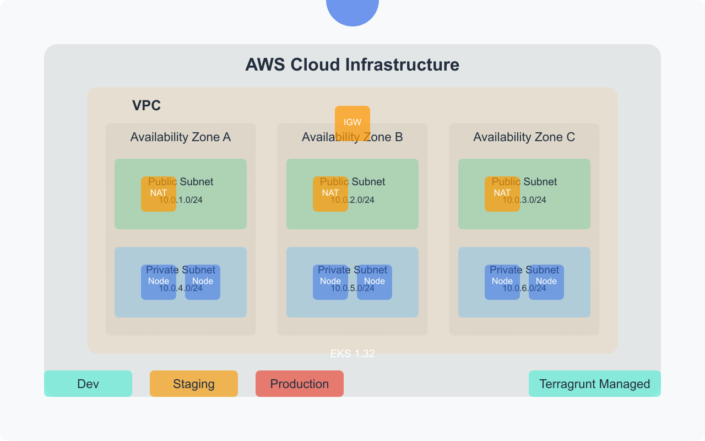

# Terragrunt with Kubernetes Infrastructure Project

<div align="center">
  
  <p><em>Enterprise-grade Infrastructure as Code for Kubernetes on AWS</em></p>
</div>

## 📋 Overview

This comprehensive project demonstrates how to implement a production-ready infrastructure using **Terragrunt** to manage multiple environments (dev, staging, prod) for **Kubernetes** deployments on **AWS EKS**. It follows infrastructure-as-code best practices with a focus on maintainability, scalability, and security.

### Key Features

- ✅ **Multi-environment Architecture**: Separate dev, staging, and production environments
- ✅ **Latest Technology Stack**: EKS 1.32, Terraform 1.7.5, Terragrunt 0.55.0
- ✅ **Infrastructure as Code**: 100% infrastructure defined as code
- ✅ **CI/CD Integration**: Automated workflows with GitHub Actions
- ✅ **DRY Configurations**: Reusable modules and inheritance patterns
- ✅ **Security Best Practices**: Proper network isolation and least privilege principles

<div align="center">
  
</div>

## 🏗️ Architecture

The infrastructure is built on AWS and consists of the following components:

### Network Layer
- **VPC** with public and private subnets across multiple availability zones
- **NAT Gateways** for outbound internet access from private subnets
- **Internet Gateway** for inbound/outbound internet access from public subnets
- **Security Groups** with least privilege access controls

### Kubernetes Layer
- **EKS Cluster** (version 1.32) with managed node groups
- **Kubernetes Namespaces** with resource quotas and network policies
- **Application Deployments** with proper resource limits and health checks
- **Services and Ingress** for application exposure

### Environment-Specific Configurations
Each environment (dev, staging, prod) has its own configuration with appropriate resource allocations:

| Environment | Instance Types | Node Count | Resource Quotas | Security Features |
|-------------|---------------|------------|-----------------|-------------------|
| Dev         | t3.medium     | 2-3        | Basic           | Standard          |
| Staging     | t3.large      | 2-4        | Moderate        | Enhanced + SSL    |
| Production  | m5.large      | 3-6        | Strict          | Maximum + SSL     |

## 📂 Project Structure

```
.
├── docs/                        # Documentation and images
│   └── images/                  # Architecture diagrams and screenshots
├── .github/
│   └── workflows/
│       └── terragrunt.yml       # CI/CD pipeline configuration
├── environments/                # Environment-specific configurations
│   ├── dev/                     # Development environment
│   │   ├── kubernetes-application/
│   │   ├── kubernetes-cluster/
│   │   ├── kubernetes-namespace/
│   │   ├── terragrunt.hcl       # Dev environment configuration
│   │   └── vpc/
│   ├── staging/                 # Staging environment
│   │   ├── kubernetes-application/
│   │   ├── kubernetes-cluster/
│   │   ├── kubernetes-namespace/
│   │   ├── terragrunt.hcl       # Staging environment configuration
│   │   └── vpc/
│   └── prod/                    # Production environment
│       ├── kubernetes-application/
│       ├── kubernetes-cluster/
│       ├── kubernetes-namespace/
│       ├── terragrunt.hcl       # Prod environment configuration
│       └── vpc/
├── modules/                     # Reusable Terraform modules
│   ├── kubernetes-application/  # Module for deploying applications to Kubernetes
│   ├── kubernetes-cluster/      # Module for creating a Kubernetes cluster
│   ├── kubernetes-namespace/    # Module for creating Kubernetes namespaces
│   └── vpc/                     # Module for creating a VPC
├── README.md                    # Project documentation
└── terragrunt.hcl               # Root Terragrunt configuration
```

<div align="center">
  
</div>

## 🚀 Getting Started

### Prerequisites

- [Terraform](https://www.terraform.io/downloads.html) (v1.7.0 or later)
- [Terragrunt](https://terragrunt.gruntwork.io/docs/getting-started/install/) (v0.55.0 or later)
- [AWS CLI](https://aws.amazon.com/cli/) configured with appropriate credentials
- [kubectl](https://kubernetes.io/docs/tasks/tools/install-kubectl/) for interacting with Kubernetes clusters

### Installation

1. Clone this repository:

```bash
git clone https://github.com/santoshbaruah/Terragrunt-EKS-infrastructure-auto.git
cd Terragrunt-EKS-infrastructure-auto
```

2. Configure AWS credentials:

```bash
aws configure
```

3. Initialize and apply the infrastructure for a specific environment:

```bash
cd environments/dev
terragrunt run-all init
terragrunt run-all plan
terragrunt run-all apply
```

4. Configure kubectl to interact with your new cluster:

```bash
aws eks update-kubeconfig --name eks-dev --region us-west-2
kubectl get nodes
```

### Destroying Infrastructure

To tear down the infrastructure when no longer needed:

```bash
cd environments/dev
terragrunt run-all destroy
```

## 🧩 Modules

### VPC Module

Creates a complete networking stack with:
- VPC with CIDR block
- Public and private subnets across multiple AZs
- Internet Gateway and NAT Gateways
- Route tables and security groups
- Proper tagging for Kubernetes integration

<div align="center">
  
</div>

### Kubernetes Cluster Module

Creates an EKS cluster with:
- EKS control plane running Kubernetes 1.32
- Managed node groups with auto-scaling
- IAM roles and policies for proper operation
- Cluster logging and monitoring
- Security group configurations

<div align="center">
  
</div>

### Kubernetes Namespace Module

Creates isolated Kubernetes namespaces with:
- Resource quotas to limit resource consumption
- Network policies for traffic control
- Labels and annotations for organization
- Service account configurations

### Kubernetes Application Module

Deploys applications to Kubernetes with:
- Deployments with replica sets
- Services for internal communication
- Ingress resources for external access
- Resource limits and requests
- Health checks and probes
- Environment-specific configurations

## 🌐 Environments

### Development (dev)

The development environment is designed for rapid iteration and testing:

- **Infrastructure**: Lightweight and cost-effective
- **Scaling**: Minimal resources with fast scaling
- **Security**: Basic security controls
- **Monitoring**: Standard logging

### Staging

The staging environment mirrors production for pre-release testing:

- **Infrastructure**: Medium-sized resources
- **Scaling**: Moderate auto-scaling capabilities
- **Security**: Enhanced security controls with SSL
- **Monitoring**: Advanced logging and basic alerting

### Production (prod)

The production environment is optimized for reliability, performance, and security:

- **Infrastructure**: Production-grade resources
- **Scaling**: Robust auto-scaling with higher limits
- **Security**: Maximum security controls with SSL and additional measures
- **Monitoring**: Comprehensive logging, monitoring, and alerting

<div align="center">
  
</div>

## 🔄 CI/CD Pipeline

This project includes a comprehensive GitHub Actions workflow for CI/CD:

<div align="center">
  
</div>

### Workflow Stages

1. **Validate**:
   - Checks Terragrunt HCL formatting
   - Validates Terraform configurations
   - Ensures code quality standards

2. **Plan**:
   - Generates execution plans for all environments
   - Shows what changes would be made
   - Runs in parallel for all environments

3. **Apply** (manual trigger):
   - Applies the changes to the specified environment
   - Requires approval for production deployments
   - Includes post-deployment verification

4. **Destroy** (manual trigger):
   - Safely tears down infrastructure
   - Requires explicit approval
   - Includes pre-destruction validation

### Setting Up CI/CD

To use the CI/CD pipeline, configure the following GitHub secrets:

- `AWS_ACCESS_KEY_ID`: AWS access key ID
- `AWS_SECRET_ACCESS_KEY`: AWS secret access key
- `AWS_REGION`: AWS region (e.g., us-west-2)

## 📊 Monitoring and Logging

The infrastructure includes built-in monitoring and logging capabilities:

- **EKS Control Plane Logging**: Sends logs to CloudWatch
- **Node Group Metrics**: Integrated with CloudWatch
- **Application Logging**: Configured for centralized logging
- **Alerting**: Ready for integration with monitoring systems

## 🔒 Security Best Practices

This project implements several security best practices:

1. **Network Isolation**: Private subnets for EKS nodes
2. **Least Privilege**: IAM roles with minimal permissions
3. **Security Groups**: Restrictive inbound/outbound rules
4. **Encryption**: Data encryption at rest and in transit
5. **Authentication**: RBAC for Kubernetes access control
6. **Network Policies**: Traffic control between namespaces

## 🛠️ Advanced Usage

### Adding a New Module

To create a new reusable module:

1. Create a directory in the `modules` folder
2. Define the module's resources, variables, and outputs
3. Reference it from environment-specific configurations

### Adding a New Environment

To add a new environment (e.g., "qa"):

1. Create a new directory under `environments`
2. Copy and modify the configuration from an existing environment
3. Update environment-specific variables

### Customizing Resource Allocations

To adjust resource allocations for an environment:

1. Modify the environment's `terragrunt.hcl` file
2. Update instance types, counts, and other parameters
3. Apply the changes with `terragrunt run-all apply`

## 📝 Best Practices

1. **DRY (Don't Repeat Yourself)**: Common configurations are defined in the root `terragrunt.hcl` file and inherited by child configurations.
2. **Environment Isolation**: Each environment has its own directory and configuration.
3. **Module Reuse**: Reusable modules are defined in the `modules` directory.
4. **Remote State**: Terraform state is stored in an S3 bucket with DynamoDB locking.
5. **CI/CD**: Changes are validated and applied through a CI/CD pipeline.
6. **Documentation**: Comprehensive documentation for all components.
7. **Version Pinning**: Explicit version constraints for providers and modules.

## 📚 Additional Resources

- [Terraform Documentation](https://www.terraform.io/docs/)
- [Terragrunt Documentation](https://terragrunt.gruntwork.io/docs/)
- [AWS EKS Documentation](https://docs.aws.amazon.com/eks/)
- [Kubernetes Documentation](https://kubernetes.io/docs/home/)

## 📄 License

This project is licensed under the MIT License - see the LICENSE file for details.

## 🤝 Contributing

Contributions are welcome! Please feel free to submit a Pull Request.
